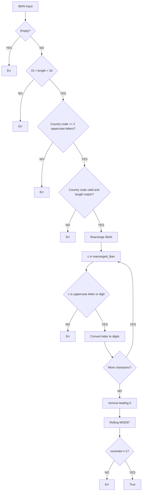

# Beschreibung des Projekts

Dieses Projekt besteht aus zwei Teilen:

##### 1.Backend(Endpunkt)：
  Das Backend dient zur Überprüfung, ob eine eingegebene IBAN korrekt ist.

##### 2.Frontend：
  Ein einfaches Interface mit einem Input-Feld und einem Button, um den Eingabeprozess und Result darzustellen.

## Endpunkt

- Das Endpunkt wurde mit Rust und Axum implementiert.
- Es lauscht auf localhost:8080 und empfängt die vom Frontend gesendete IBAN.
- Anschließend wird die IBAN überprüft, und das Ergebnis wird an das Frontend zurückgegeben.

## Validierungslogik


## Anleitung zum Starten des Projekts

Zuerst öffnen Sie ein Terminal im Projektordner und starten das Endpunkt:
```
cd ./rust_axum
cargo run
```
Öffnen Sie ein weiteres Terminal für das Frontend:
```
cd ./iban_frontend
npm install
npm run dev
```
Danach öffnen Sie einen Browser und rufen folgende Adresse auf:
```
http://localhost:5173
```
Falls der Port unterschiedlich ist, verwenden Sie bitte den Port, der im zweiten Terminal angezeigt wird.

Geben Sie anschließend eine IBAN in das Input-Feld ein und klicken Sie auf Submit, um die Validierung zu starten.

